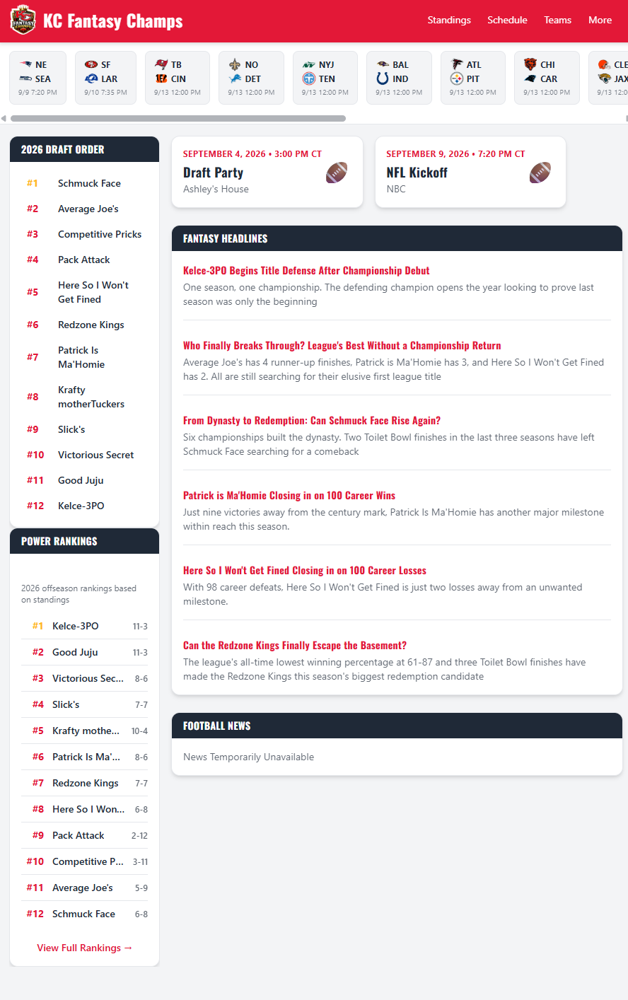
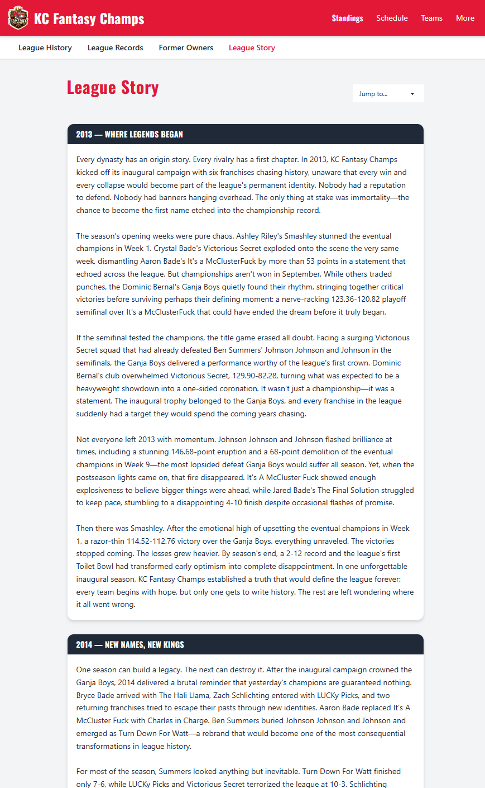
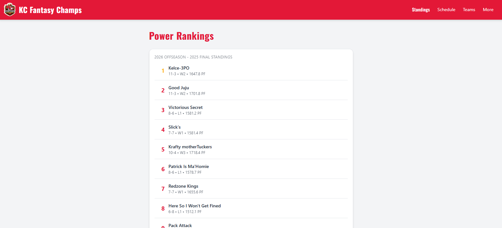
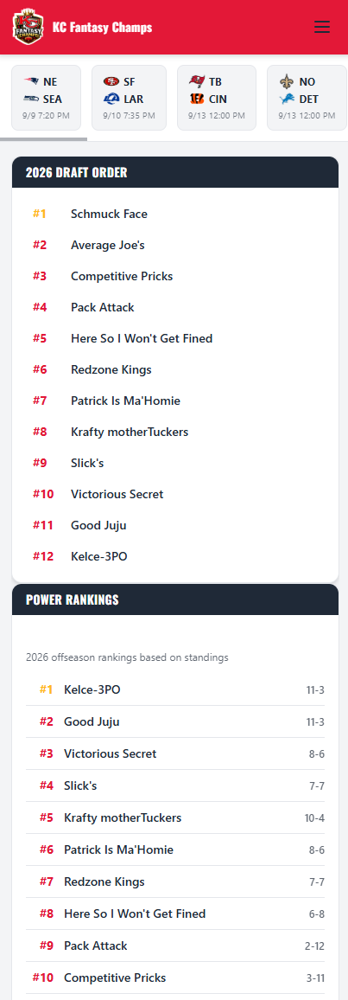

# KC Fantasy Champs

The official website for the KC Fantasy Champs fantasy football league — running strong since 2013. Built from scratch to give a 12-team league a real home: live standings, power rankings, a full league archive, and even an AI-assisted written history of the league going back to its founding season.

🔗 **[kcfantasychamps.com](https://kcfantasychamps.com)**

## Screenshots

| Home | League Story |
|---|---|
|  |  |

| Power Rankings | Home (Mobile) |
|---|---|
|  |  |

## Features

- **Home dashboard** — draft order, upcoming events, live power rankings, storylines, fantasy news, and NFL scores at a glance
- **Team pages** — rosters with keeper costs, team history, head-to-head records, draft history, and awards, all owner-scoped
- **Power Rankings** — a custom multi-phase weighted algorithm with week-over-week movement tracking and AI-assisted commentary
- **League Archive**
  - **League History** — every champion and "Toilet Bowl" finisher since 2013
  - **All-Time Franchise Records** — career records for every owner who's ever played, current or departed
  - **Former Owners** — dedicated pages for owners no longer in the league
  - **League Records** — single-game, single-season, and career record books
- **League Story** — an AI-assisted, chapter-by-chapter written history of the league, generated from real season data (champions, rivalries, ownership changes, rebrands, streaks, and more) and styled like a sports documentary recap
- **Awards** — league champion and "Toilet Bowl" trophies, with a full season-awards program on the way
- **Schedule** — fantasy matchups and the full NFL schedule, week by week
- **Admin dashboard** — score entry, standings computation, final rankings, roster management, and AI-assisted content generation for Power Rankings blurbs, storylines, and League Story chapters

## Tech Stack

- **Frontend:** Vanilla HTML, CSS, and JavaScript (ES modules) — no framework
- **Styling:** [Tailwind CSS v4](https://tailwindcss.com/) + [DaisyUI 5](https://daisyui.com/)
- **Backend:** [Supabase](https://supabase.com/) (Postgres database, auth, and Edge Functions)
- **Fonts:** Google Fonts (Oswald)

## Project Structure

```
├── supabaseClient.js       # Supabase client initialization
├── src/
│   ├── api/                # Data access layer — one file per Supabase table/domain
│   ├── pages/               # Page-level render logic
│   ├── components/         # Shared UI components (navbar, archive sub-nav, etc.)
│   └── utils/               # Shared logic (keeper cost calculation, fact generators, etc.)
├── *.html                  # One HTML entry point per page
└── output.css               # Compiled Tailwind output
```

Data flows in one direction: `supabaseClient.js` → `src/api/` → `src/pages/` → `src/components/`.

## Local Development

Install dependencies and start the Tailwind watcher — this needs to be running for any styling changes to take effect:

```bash
npx @tailwindcss/cli -i ./src/styles.css -o ./output.css --watch
```

You'll also need a Supabase project configured, with your credentials set in `supabaseClient.js`.

## About This Project

This site was built as a hands-on learning project — every line hand-typed, iterated on, and debugged from the ground up. It's a living project that grows with each new season: new features, deeper history, and better tools for the league, added as time (and offseasons) allow.
